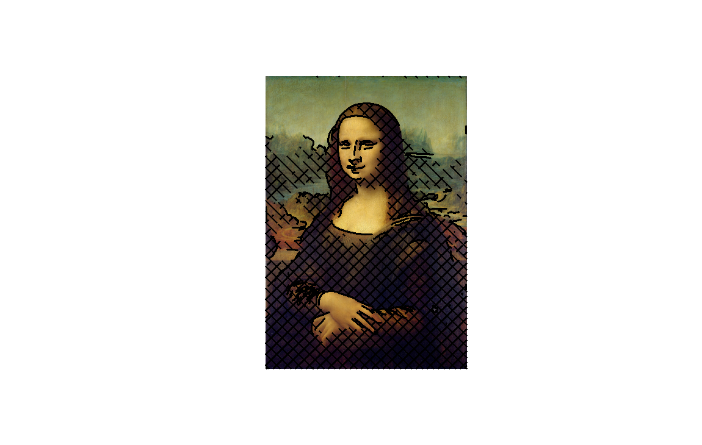

# PHINEAS

**P**lotting **H**ardware for **I**nteractive **N**otation, **E**rasing, **A**nd **S**ketching — a
belt-driven polargraph that draws on a standard classroom whiteboard. Drop an image into the
browser, place it on a scale drawing of your board, and the machine draws it with a dry-erase
marker.

<p align="center">
  
  
</p>

A gondola hangs from two GT2 belts driven by stepper motors in the top corners of the board. Its
position is set entirely by the two belt lengths, so moving the pen means solving for those two
lengths and stepping both motors together. A hobby servo on the gondola lifts the marker off the
board between strokes.

## How it works

```
image ──▶ OpenCV                ──▶ path planner            ──▶ Flask API ──▶ ESP32 ──▶ steppers
          contours / hatching       ordering, pen-up/down        batches       inverse    + pen servo
          /  dark fill              interpolation, merging       of 200 pts    kinematics
```

1. **Trace.** `polargraph/image_processing.py` reduces the image to pen strokes, in one of three
   modes: `contour` (edge outlines with centerline extraction), `hatch` (outlines plus angled
   hatching whose density follows image brightness), or `fill` (outlines plus solid fill of dark
   regions).
2. **Plan.** `polargraph/path_planner.py` splits and merges contours where they nearly touch,
   orders them nearest-neighbour to cut travel, then interpolates every stroke to a fixed step
   size and marks each point pen-up or pen-down.
3. **Preview.** The React client renders the planned path over a scale drawing of the board, so
   you can see the result and the estimated draw time before committing a marker to it.
4. **Stream.** `polargraph/path_sender.py` pushes the path to the ESP32 in 200-point batches on a
   background thread, keeping the controller's queue full without blocking the API. Progress,
   pause, resume, and cancel are all polled over HTTP.
5. **Draw.** The firmware converts each point to a pair of belt lengths, steps both motors in
   coordinated fashion, and drives the pen servo. It parks the gondola when the job finishes.

## Layout

| Path | What's in it |
|---|---|
| `client/` | React + Tailwind front end: board layout editor, drawing-method controls, live job monitor, motor jog/test pages. |
| `visualization/` | Flask API and the `polargraph` Python package — kinematics, image processing, path planning, and the batched path sender. |
| `visualization/examples/` | Standalone scripts: shapes, calibration squares, timing tests, a diagnostic suite. |
| `visualization/tests/` | Unit tests for the kinematics and path planning. |
| `firmware/` | ESP32 Arduino sketch (WebServer + TMCStepper + ESP32Servo) and two PowerShell helpers for poking the controller by hand. |
| `Demo/` | Sample output. |

CAD (`.3mf` printable parts), the KiCad project for the driver board, and the bill of materials
live outside the repo — ask if you want them.

## Running it

**Backend** (Python 3.8+):

```bash
cd visualization
python -m venv .venv && .venv/Scripts/activate   # source .venv/bin/activate on macOS/Linux
pip install -r requirements.txt
python app.py                                    # serves on :8001
```

**Front end** (Node 18+):

```bash
cd client
npm install
npm start                                        # dev server on :3000, talking to the API on :8001
```

`npm run build` emits into `client/build/`, which `app.py` serves directly — so a production run is
just the Flask process.

**Firmware** (Arduino IDE or `arduino-cli`, ESP32 board support installed):

1. Copy `firmware/polargraph_firmware/secrets.example.h` to `secrets.h` in the same folder and fill
   in your WiFi credentials. That file is gitignored.
2. Check the machine geometry constants at the top of `polargraph_firmware.ino` —
   `BOARD_WIDTH_MM`, `BOARD_HEIGHT_MM`, `SPOOL_DIAMETER_MM`, `MICROSTEPS`, and the pen servo
   angles all have to match your build.
3. Flash it. The sketch prints its IP on the serial console; paste that into the client's
   controller URL field.

Libraries used by the sketch: `ArduinoJson`, `TMCStepper`, `ESP32Servo`.

## API

Flask (`visualization/app.py`):

| Endpoint | Purpose |
|---|---|
| `POST /api/visualize` | Plan a drawing from a board layout; returns the preview, path stats, and optionally starts streaming. |
| `POST /api/animation` | Render an animated preview of the planned path. |
| `POST /api/send-path` | Queue a path for transmission; returns a job id immediately. |
| `GET /api/send-path/status` | Poll progress, totals, and errors for the active job. |
| `POST /api/send-path/{cancel,pause,resume}` | Control the in-flight job. |
| `GET,POST /api/controller/status` | Read the cached ESP32 status, or point the poller at a controller. |

ESP32 (`firmware/polargraph_firmware/`):

| Endpoint | Purpose |
|---|---|
| `GET /api/status` | Position, queue depth, pen state, job flags. |
| `POST /api/move` | Move to an absolute coordinate. |
| `POST /api/pen` | Raise or lower the pen. |
| `POST /api/path` | Enqueue a batch of points. |
| `POST /api/cancel` | Stop and flush the queue. |
| `POST /api/park` | Return the gondola to its parking position. |

## Machine

| | |
|---|---|
| Controller | ESP32-S dev board (WiFi, HTTP server, FreeRTOS task for motion) |
| Motors | 2 × NEMA 17 (1.5 A, 42 Ncm), TMC2209 drivers addressed over UART, 32 microsteps |
| Motion | GT2 belt on 12 mm spools, ≈170 steps/mm, 6000 steps/s ceiling |
| Pen | Hobby servo on the gondola, 45° up / 105° down |
| Board | 1150 × 730 mm drawing area as configured |

## Tests

```bash
cd visualization
pip install pytest
python -m pytest tests
```

## License

MIT — see [LICENSE](LICENSE).
